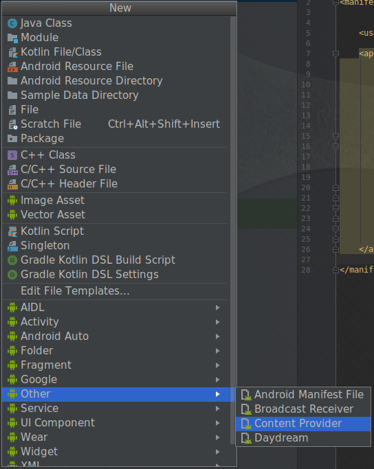
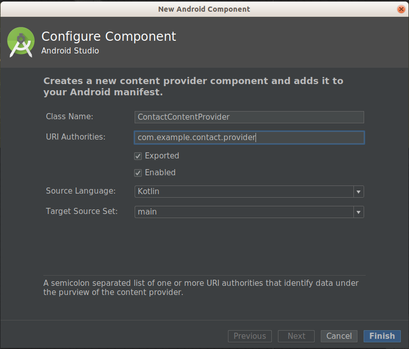

# 콘텐츠프로바이더(ContentProvider)
 - 콘텐츠 프로바이더는 앱 간의 데이터 공유를 목적으로 사용되는 컴포넌트이다.
 - 데이터를 외부 앱에 공유하거나 반대로 외부 앱이 가지고 있는 데이터를 획득할 목적으로 사용된다.

## 콘텐츠프로바이더 생성
- 프로젝트 탭에서 마우스 우측 버튼을 눌러 신규에서 Other > Content Provider 를 선택한다.


- 콘텐츠프로바이더 생성 위저드 창에 클래스 명과 URI Authorities 입력한다.
- URI Authorities 는 유일해야 하는 값으로 디바이스 내에 동일한 값이 있다면 설치되지 않는다.



- AnddoridManifest.xml 파일에 다음과 같이 provider 가 등록된다.

```xml
<?xml version="1.0" encoding="utf-8"?>
<manifest xmlns:android="http://schemas.android.com/apk/res/android"
          package="com.example.contactapp">
    <application
        ...
        <provider
                android:name="com.example.datapersistence.ContactContentProvider"
                android:authorities="com.example.contact.provider"
                android:enabled="true"
                android:exported="true">
        </provider>
    </application>
</manifest>
```

- 또한 클래스가 다음과 같이 자동으로 생성된다.
```kotlin
package com.example.datapersistence

import android.content.ContentProvider
import android.content.ContentValues
import android.database.Cursor
import android.net.Uri

class ContactContentProvider : ContentProvider() {

    override fun delete(uri: Uri, selection: String?, selectionArgs: Array<String>?): Int {
        TODO("Implement this to handle requests to delete one or more rows")
    }

    override fun getType(uri: Uri): String? {
        TODO(
            "Implement this to handle requests for the MIME type of the data" +
                    "at the given URI"
        )
    }

    override fun insert(uri: Uri, values: ContentValues): Uri? {
        TODO("Implement this to handle requests to insert a new row.")
    }

    override fun onCreate(): Boolean {
        TODO("Implement this to initialize your content provider on startup.")
    }

    override fun query(
        uri: Uri, projection: Array<String>?, selection: String?,
        selectionArgs: Array<String>?, sortOrder: String?
    ): Cursor? {
        TODO("Implement this to handle query requests from clients.")
    }

    override fun update(
        uri: Uri, values: ContentValues?, selection: String?,
        selectionArgs: Array<String>?
    ): Int {
        TODO("Implement this to handle requests to update one or more rows.")
    }
}

```