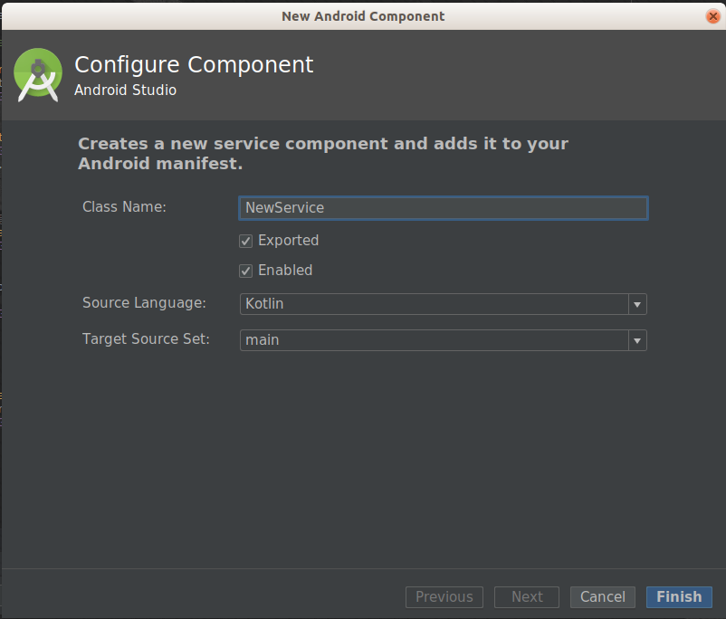

# Service
- 서비스는 앱이 스마트폰 화면을 점유하고 있지 않더라도 장시간 백그라운드에서 적업을 하기 위한 컴포넌트이다.
- 앱의 화면이 스마트폰에 떠 있는 동안만 진행되어야 한다면, 서비스가 아닌 액티비티로 작성하는 게 좋다.
- 서비스는 다른 앱이 사용자 화면을 점유하고 있더라도 앱의 프로세스가 살아서 계속 무언가 작업을 수행해야 할 때 사용하는 컴포넌트이다.
- 서비스도 인텐트로 수행되는 컴포넌트 클래스이다.

## 서비스 생명주기


(출처) http://ndpaulkim.tistory.com/92

1. startService() 함수 이용 시 생명주기
- 서비스 시작: onCreate() -> onStartCommand() 순으로 함수가 자동 호출되면서 Runnnig 상태가 된다.
- 이미 실행 중인 서비스를 다시 startService() 함수를 호출하면 객체는 다시 생성되지 않고 onStartCommand() 함수만 한 번 호출된다.
- 서비스 종료: onDestory()

2. bindService() 함수 이용 시 생명주기
- 서비스 시작: onCreate() -> onBind() 함수가 호출되면서 Running 상태가 된다.
- 서비스 종료: unBind() -> onDestory() 함수가 호출된다.
- 이미 실행 중인 서비스를 bindService() 함수로 실행하면 객체가 매번 생성되지 않고 onBind() 함수만 반복 호출된다.

# IntentService
- 생명주기가 일반 서비스와 다르다.
- 일반 서비스는 stopService() 함수로 종료해야 하지만 인텐트 서비스는 자동으로 종료된다.
- 일반 서비스 생명주기에 onHandleIntent() 함수 하나 더 있으며, 이 함수의 수행이 끝나면 자동으로 종료된다.


# 백그라운드 서비스 제한
- 안드로이드 Oreo 버전부터는 백그라운드 실행에 제한이 있다.
- 앱이 포그라운드에 있는 경우 서비스 이용에는 제약사항이 없다.
- 포그라운드는 다음의 경우로 판단한다.
    * 액티비티의 시작, 일시 중지에 상관없이 보이는 액티비티가 있는 경우
    * 포그라운드 서비스가 있는 경우
    * 앱의 서비스 중 하나에 바인드하거나 
    * 앱의 콘텐츠 제공자 중 하나를 사용하여 앱에 또 다른 포그라운드 앱이 연결된 경우

__대표적 사례__
 * 스마트폰 부팅 완료되자마자 실행되는 리시버에서 서비스를 구동하는 경우
 * 안드로이드 오레오 전 까지는 문제없이 잘 실행 되지만, 오레오 부터는 백그라운 서비스 구동을 위한 인텐트 발생시 에러가 난다.

## 포그라운 서비스
- startForegroundService() 함수에 의해 실행
- 알림을 위한 startForeground() 함수를 호출해야 한다.
- 빠른 시간 내에 startForeground() 함수를 호출하지 않으면 서비스는 자동으로 종료된다.


# 서비스 구현
- 프로젝트 탭에서 우측 버튼 클릭하여 새로운 서비스를 생성한다.




- Service 클래스를 상속 받는 새로운 클래스가 생성된다.

```kotlin
class MyService : Service() {
    override fun onBind(intent: Intent?): IBinder? {
        return null
    }

    override fun onCreate() {
        super.onCreate()
    }

    override fun onStartCommand(intent: Intent?, flags: Int, startId: Int): Int {
        return super.onStartCommand(intent, flags, startId)
    }

    override fun onDestroy() {
        super.onDestroy()
    }
}
```

- AndroidManifest.xml 에 \<service> 태그가 추가 된다.
```xml
<service
        android:name=".MyService"
        android:enabled="true"
        android:exported="true">
</service>
```


1. startService() 함수 호출에 의한 서비스 시작
- 인텐트를 생성하여 서비스를 실행한다.
```kotlin
val intent = Intent(this, MyService::class.java)
// 서비스의 시작
startService(intent)
// 서비스의 종료
stopService(intent)
```

2. bindService() 함수 호출에 의한 서비스 시작

- Binder 클래스를 상속 받아 Service 참조를 리턴하는 메서드를 구현한다.
- onBind() 메서드에서 Binder를 리턴하도록 작성한다.

```kotlin
    // 서비스 클래스 내 inner class로 작성
    inner class LocalBinder: Binder()
    {
        // 서비스의 참조를 리턴한다.
        fun getService(): MyService {
            return this@MyService
        }
    }

    // 위 Binder를 리턴하는 onBind() 메서드 작성
    val binder: IBinder = LocalBinder()

    override fun onBind(intent: Intent): IBinder {
        return binder
    }
```

- ServiceConnection 인터페이스 다음과 같이 구현 한다.
- onServiceConnected() 메서드는 bindService() 함수로 서비스가 구동하는 시점에 호출된다.
- onServiceDisconnected() 메서드는 unbindService() 함수로 인해 서비스가 종료된 시점에 호출된다.
- 액티비티에서 Service를 참조하여 Service에 추가 구현된 기능의 메서드를 호출할 수 있다.

```kotlin
    private val mConnection = object : ServiceConnection {
        override fun onServiceDisconnected(name: ComponentName?) {
            myService = null
        }

        override fun onServiceConnected(name: ComponentName?, service: IBinder?) {
            val binder = service as MyService.LocalBinder
            // 액티비티에서 Service를 참조하여 Service에 추가 구현된 기능의 메서드를 호출할 수 있다.
            myService = binder.getService()
            ...
        }
    }
```

- 버튼 클릭 등의 적절한 이벤트에 bindService() 함수를 호출하여 서비스 시작.
```kotlin
var intent = Intent(this, MyService::class.java)
bindService(intent, mConnection, Context.BIND_AUTO_CREATE)
// 서비스 종료
unbindService(mConnection)
```